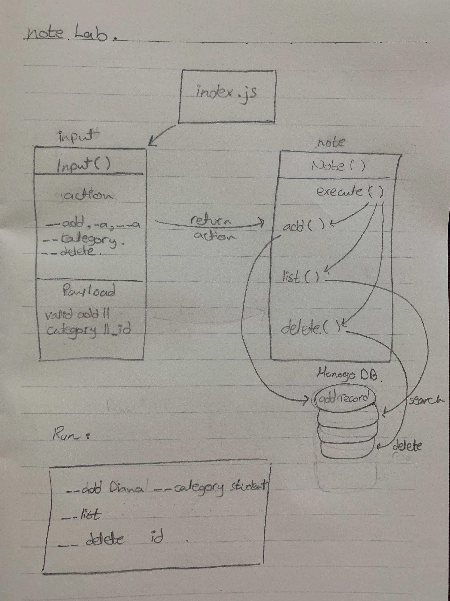

# notes

# LAB - Class 01

## Project: Notesy

### Author: Amal Almomani

### Links and Resources

- [submission PR](https://github.com/amal-401-advanced-javascript/notes/pull/6)
- [ci/GitHub Actions](https://github.com/amal-401-advanced-javascript/notes/runs/720567821?check_suite_focus=true)

### Setup

#### `.env` requirements 
- `MONGODB_URI` -

#### How to initialize/run your application (where applicable)

- * node index.js (--add with a note and --category for the category) || (--a/-a)
- * node index.js --list to show all the notes or you can do -- list with a category 
- * node index.js --delete with an id to delete a note 
#### How to use your library (where applicable)
 
- npm i minimist => minimist
- npm i dotenv => dotenv
- npm i monogoose => npm i monogoose

#### Tests
- npm i -D jest => jest 
- npm install -D lint => lint

- How do you run tests?
- Any tests of note?
- Describe any tests that you did not complete, skipped.

#### UML

- 
